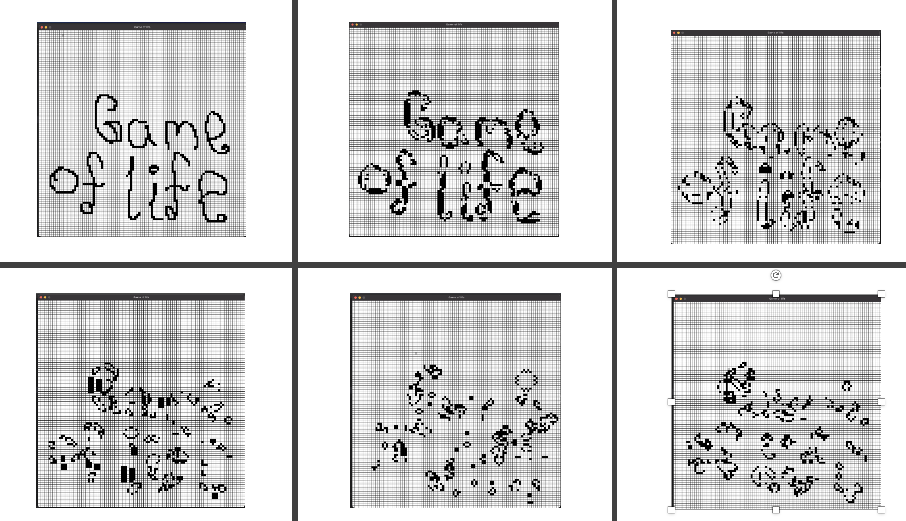

# Conways game of life
## Content

[TOC]

## Description
This is a simple implementation of John Conways famous 2D cellular automata  [Game Of Life](https://en.wikipedia.org/wiki/Conway%27s_Game_of_Life). The scope of the project is to learn about the game, as well as an exercise for implementing algorithms in C++ using [SDL](https://www.libsdl.org/) as engine for visualizing the game

## Implementation outline
The world consists of a nxm grid of cells that is either dead or alive. The rending in SDL runs on O(nxm), which is a loop for each dimention, and deos not scale very well with the world size. One could have implemented this by only re-rendering the cells in neighbourhoods where changes occurs to the next state. 
The alive cells are (x, y) pairs stored in a vector container, and the correspoding neighbour counts are found by using the exact same vector for each pair. Which again is highly ineffective, as only the cell changes of the world are the ones of interest.

## How to play
The initial screen show an empty grid with nxm cells. Default is draw mode, and cells can come to life be left clicking and dragging the cursor above dead cells. Now there is the following options
- Press R, for running the automata
- Press S, for stopping the automata, and entering draw mode
- Press C, for clearning the screen for live cells. 
The folloing show an example of a simple game. 

## Comments
The algorithm could have been implemented much better in terms of efficiency. There exists optimal implementations (e.g [Hashlife][https://en.wikipedia.org/wiki/Hashlife]), as well as a great variety of different memory models and algorithms for calculating next world states, however the scope was to implement the game using only, the rules and the SDL as the visual tool.

